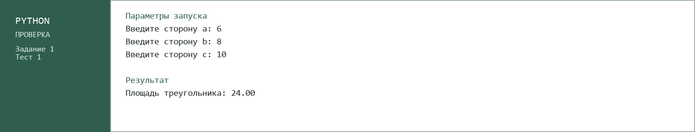
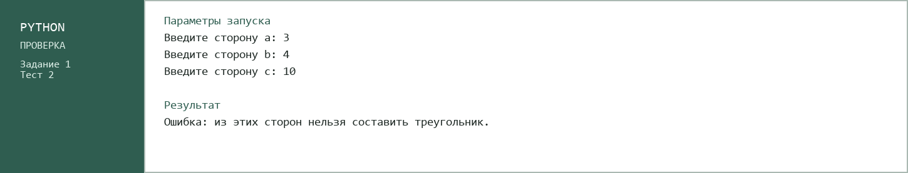
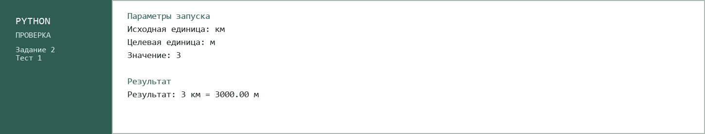
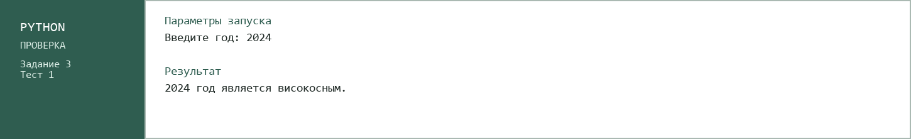
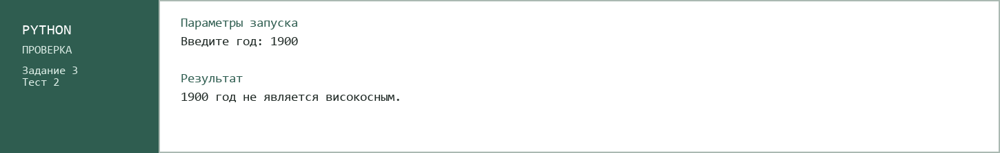

# Лабораторная работа №1

## Исполнитель

Шубин Владислав, группа ФТ-250007.

## Тема работы

Операторы ввода и вывода. Условный оператор.

## Задание 1.1. Калькулятор площади треугольника

Программа запрашивает длины трёх сторон треугольника и вычисляет его площадь по формуле Герона. Перед вычислением выполняется проверка, можно ли составить треугольник из введённых сторон.

### Как открыть и запустить

Проект можно открыть в Visual Studio Code, PyCharm или другой среде разработки с поддержкой Python 3.

1. Откройте папку `task-1-triangle`.
2. Откройте файл `main.py`.
3. Запустите файл кнопкой запуска в среде разработки или командой:

```bash
python main.py
```

Введите три стороны треугольника. Программа выведет площадь или сообщение об ошибке.

### Скриншоты тестов





## Задание 1.2. Конвертер единиц измерения расстояния

Программа переводит расстояние между единицами км, м, см, мм, mi и yd.

### Как открыть и запустить

Проект можно открыть в Visual Studio Code, PyCharm или другой среде разработки с поддержкой Python 3.

1. Откройте папку `task-2-converter`.
2. Откройте файл `main.py`.
3. Запустите файл:

```bash
python main.py
```

Введите исходную единицу, единицу результата и значение. Программа покажет результат перевода.

### Скриншоты тестов




## Задание 2. Определение високосного года

Программа получает год и определяет, является ли он високосным. При проверке учитываются правила деления на 4, 100 и 400.

### Как открыть и запустить

Проект можно открыть в Visual Studio Code, PyCharm или другой среде разработки с поддержкой Python 3.

1. Откройте папку `task-3-leap-year`.
2. Откройте файл `main.py`.
3. Запустите файл:

```bash
python main.py
```

Введите год. Программа сообщит результат проверки.

### Скриншоты тестов




